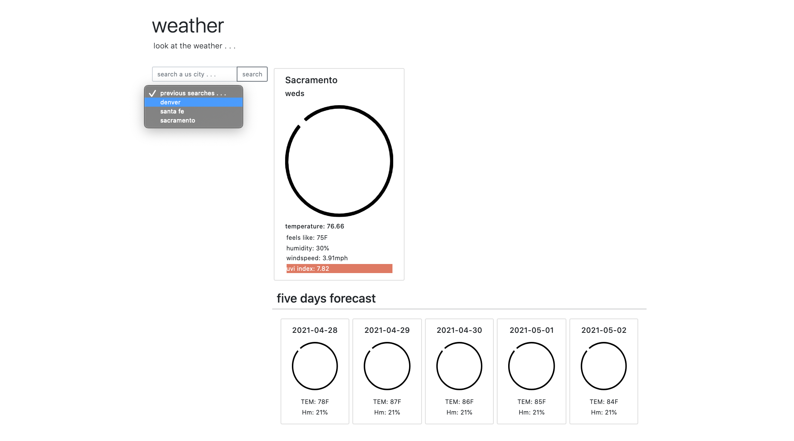
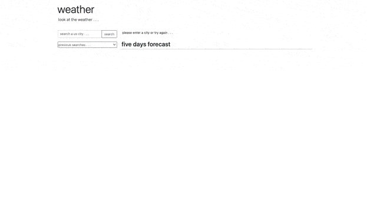

# Weather Dashboard

## Description
- A minimalist weather dashboard giving you just what you need

### The User Story for this project is as follows:
- AS A traveler, I WANT to see the weather outlook for multiple cities, SO THAT I can plan a trip accordingly

### The codebase meets the following criteria for acceptance:
- WHEN I search for a city, THEN I am presented with current and future conditions for that city and that city is added to the search history
- WHEN I view current weather conditions for that city, THEN I am presented with the city name, the date, an icon representation of weather conditions, the temperature, the humidity, the wind speed, and the UV index
- WHEN I view the UV index, THEN I am presented with a color that indicates whether the conditions are favorable, moderate, or severe
- WHEN I view future weather conditions for that city, THEN I am presented with a 5-day forecast that displays the date, an icon representation of weather conditions, the temperature, and the humidity
- WHEN I click on a city in the search history, THEN I am again presented with current and future conditions for that city

### Installation
- The project is uploaded to [GitHub](https://github.com/) at the following repository: [here](https://github.com/sourslaw/06_Weather_Dashboard)
- Deployed application may be seen: [here](https://sourslaw.github.io/06_Weather_Dashboard/)

### Usage

- Entering the name of a US city, the user is presented with the temperature, humidity, windspeed, and uv index for the day
	- UV index information is highlighted by color based on risk of harm
- A five day forecast presents the temperature and humidity for the following five days
- Previous searches can be selected from the drop-down menu
- Upon reload/closing of the window, the application will store the last search in local storage and reload the page with the weather information

### Credits
- [Bootstrap](https://getbootstrap.com/)
- [OpenWeather API](https://openweathermap.org/api)
- [positionstack API](https://positionstack.com/documentation)

### License
- Licensed under the [MIT](https://opensource.org/licenses/mit-license.php) license.